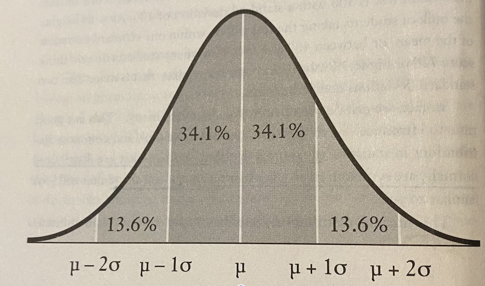

# Naked Statistics: Stripping the Dread from the Data (Charles Wheelan)

The following are my notes and may contain direct excerpts from the book.

## Introduction
- 'The problem is that if the data are poor, or if the statistical techniques are used improperly, the conclusions can be wildly misleading and even potentially dangerous'

    *Example:*
According to a study of 36,000 office workers, those workers who repoorted leaving their offices to take regular ten-minute breaks during the workday were 41% more likely to develop cancer over the next five years, than those who don't leave their offices during the workday.
    - so, taking short breaks at work causes cancer?
    - maybe we just need to think more clearly about what many workers are doing during that 10 minute break (many who leave for breaks are huddled outside smoking cigarettes -- creating a haze of smoke through which other break-takers have to walk in order to get in or out of the building)
    - which is the likely cause of cancer -- taking breaks or smoking?
    
- 'Statistics is like a high-caliber weapon: helpful when used correctly and potentially disastrous in the wrong hands.'
- 'It's easy to lie with statistics, but it's hard to tell the truth wiouth them' -- Andrejs Dunkels, Swedish mathematician and writer

## Chapter 1: What's the Point?

Use data from the 'known world' to make informed inferences about the 'unknown world'
- summarize huge quantities of data
- make better decisions or answer important questions
- recognize patterns that can refine how we do things
- catch cheaters/criminals
- evaluate effectivenessd of policies, programs, products, etc.
- know that there are scoundrels out there that will use these powerful tools for nefarious purposes

Descriptive statistics exist to simplify, which always implies some loss of nuance or detail. Overreliance on any descriptive statistic can lead to misleading conclusions, or cause undesirable behavior
- **Gini index**: standard tool in economics for measuring income inequality, collapses complex information into a single number
- **Sampling** is the process of gathering data for a small area and then using those data to make an informed inference about the entire population

- **Regression analysis** enables us to isolate a relationship between two variables, while holding constant (or 'controlling for') the effects of other variables. {see notes on Chapter 11}

## Chapter 2: Descriptive Statistics

Descriptive statistics summarize the information in a data set in a meaningful way that make reveal patterns  (i.e., mean, median, standard deviation, percentile scores), however, they do not allow us to make conclusions beyond the data

- percentiles divide the distribution into hundredths, this can give you a measure as to how, for example, your score on a test ranks relative to all other test takers.  

- standard deviation - allows us to assign a single number to describe how far the data are dispersed from their mean  (standard deviation is the square root of the variance)

- variance - calculated by determining how far the observations within a distribution lie from the mean {formula for variance is on page 34}

- normal distribution - symmetrical around their mean in a bell shape in this way:
        - 68.2% are within one standard deviation of the mean()
        - 95.4% are within two standard deviations of the mean
        - 99.7% are within three standard deviations of the mean
        

Measuring change as a percentage gives us some sense of scale. (remember percent of change is amount of change divided by original amount)

The advantage of any index is that it consolidates lots of complex information into a single number.

## Chapter 3: Deceptive Description

The overall lesson of this chapter is that statistical malfeasance has very little to do with bad math. If anything,  impressive calculations can obscure nefarious motives.  The fact that you've calculated the mean correctly will not alter the fact that the median is the more accurate indicator.  Judgment and integrity turn out to be surprisingly important. A detailed knowledge of statistics does not deter wrongdoing any more than a detailed knowledge of the law averts criminal behavior.
    
- Pay attention to the unit of analysis
- The median is not sensitive to outliers
- The median v. mean question revolves around whether the outliers in a distribution distort what is being described or are instead an important part of the message.
- Any comprehensive statistical analysis would likely present both the mean and the median.
- **real figures** are adjusted for inflation.
- **nominal figures** are not adjusted for inflation.
    
A statistical index has all the potential pitfalls of any descriptive statistic - plus the distortions introduced by combining multiple indicators into a single number. By definition, any index is going to be sensitive to how it is constructed; it will be affected both by what measures go into the index and by how each of those measures is weighted.  In the end, the important question is whether the simplicity and ease of use introduced by collapsing many indicators into a single number outweighs the inherent inaccuracy of the process.
        
    
## Chapter 4: Correlation

Correlation meansures the degree to which two phenomena are related to one another. Two variables are positively correlated if a change is one is associated with a change in the other in the same direction. In a negative association, one increases while the other decreases.

- **correlation coefficient** is a single number between -1 and 1
    - correlation of 1 is a perfect positive correlation (every change in one variable is associated with an equivalent change of the other variable in the same direction)
    - correlation of -1 is a perfect negative correlation (every change in one variable is associated with an equivalent change of the other variable in the oppposite direction)
    - the closer a correlation is to 1 or -1, the stronger the association
    - A correlation close to 0 suggests the variables have no meaningful association with each other
    
**Remember that correlation does not imply causation!**